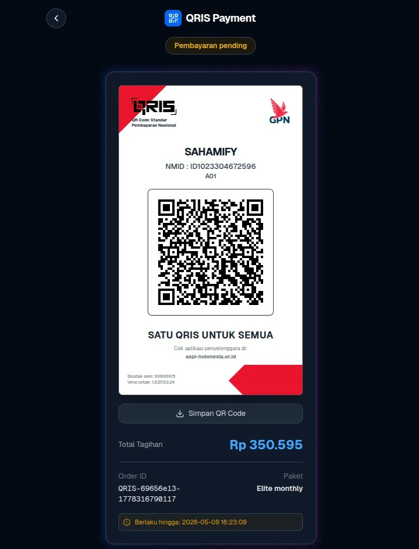

# 🚀 KlikQRIS Adapter

Adapter premium, modular, dan framework-agnostic untuk mengintegrasikan payment gateway **KlikQRIS** ke dalam aplikasi JavaScript/TypeScript apa pun.



Adapter ini memisahkan logika pembayaran inti dari framework tertentu, memungkinkan Anda menggunakannya di Next.js, Express, NestJS, atau bahkan lingkungan Node.js murni.

---

## ✨ Fitur

- **Framework Agnostic**: Client TypeScript murni yang dapat berjalan di mana saja.
- **Integrasi Mudah**: API sederhana untuk membuat transaksi dan memverifikasi tanda tangan (signature).
- **Next.js Ready**: Termasuk rute API dan komponen UI siap pakai untuk deployment cepat.
- **Type Safe**: Dukungan penuh TypeScript dengan interface detail untuk request dan response.
- **UI Menawan**: Termasuk komponen premium `QRISPoster` untuk pengalaman pembayaran yang profesional.

---

## 🛠️ Instalasi

1. **Clone atau salin** file ke dalam proyek Anda.
2. **Instal dependensi**:
   ```bash
   npm install axios
   ```

---

## ⚙️ Konfigurasi

Tambahkan variabel lingkungan (environment variables) berikut ke file `.env` Anda:

```env
KLIKQRIS_API_KEY=api_key_anda_di_sini
KLIKQRIS_MERCHANT_ID=merchant_id_anda_di_sini
```

---

## 🚀 Memulai Cepat (Core Adapter)

```typescript
import { klikQris } from './lib/klikqris/adapter';

// Buat transaksi
const result = await klikQris.createTransaction({
  orderId: 'ORDER-123',
  amount: 50000,
  description: 'Langganan Premium'
});

if (result.status) {
  console.log('URL QRIS:', result.data.qris_url);
}
```

---

## 📂 Struktur Proyek

- `lib/klikqris/`: Client inti yang independen dari framework.
  - `adapter.ts`: Class utama `KlikQrisClient`.
  - `types.ts`: Interface TypeScript untuk API.
- `api/klikqris/`: **Contoh** implementasi Next.js App Router.
  - `route.ts`: Endpoint pembuatan transaksi.
  - `status/`: Polling status pembayaran.
  - `webhook/`: Verifikasi dan aktivasi pembayaran otomatis.
- `component/ui/klikqris/`: **Contoh** komponen UI.
  - `QRISPoster.tsx`: Komponen tampilan QRIS profesional.

---

## 🖥️ Implementasi Next.js

Jika Anda menggunakan Next.js, Anda cukup memindahkan folder `api` dan `component` ke direktori `src` atau root proyek Anda.

### Penggunaan UI:

```tsx
import QRISPoster from '@/component/ui/klikqris/QRISPoster';

// Di halaman pembayaran Anda
<QRISPoster 
  qrisUrl={paymentData.qrisUrl} 
  merchantName="NAMA BISNIS ANDA"
/>
```

---

## 🛡️ Lisensi

MIT
